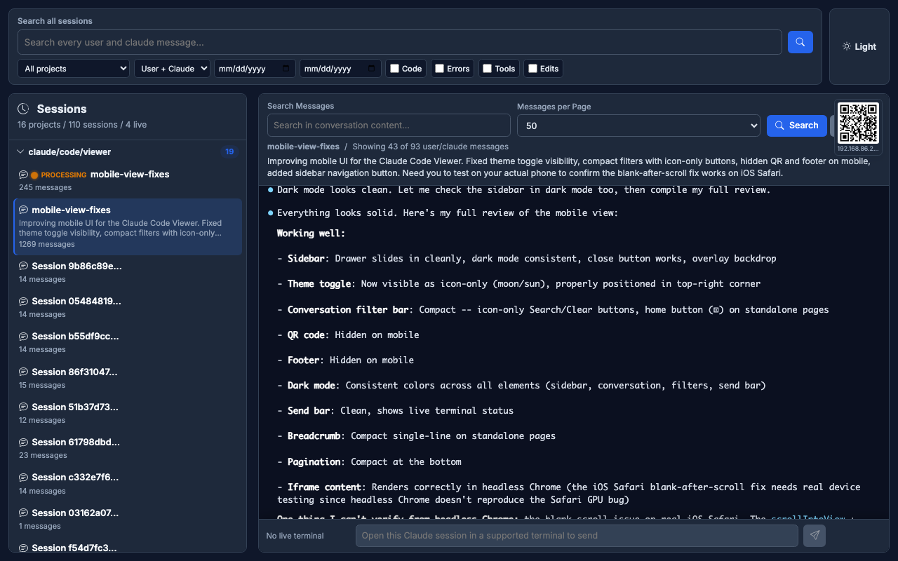
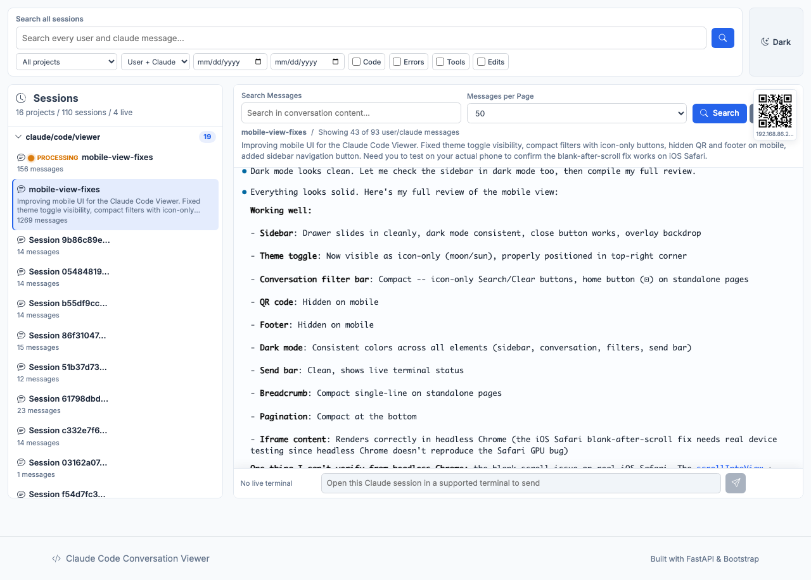
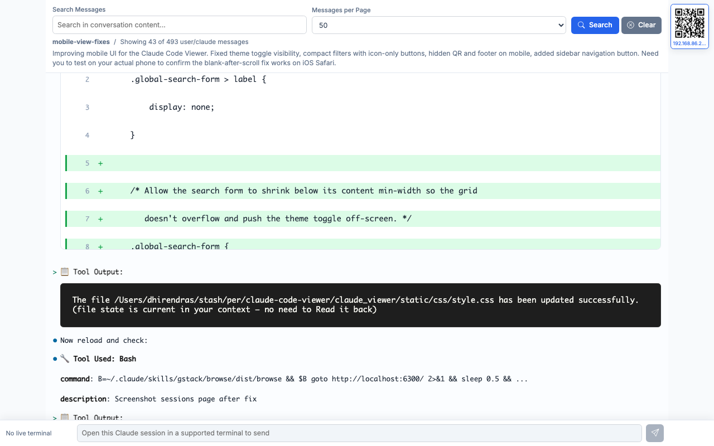

# cocoview

A local command center for your [Claude Code](https://docs.anthropic.com/en/docs/claude-code) sessions.

Search past conversations, inspect diffs and tool calls, watch live session status, and send messages to active Claude Code sessions from your desktop or phone over your local network.



## Install

```bash
pip install cocoview
```

## Usage

```bash
cocoview
```

Opens at [localhost:6300](http://localhost:6300). cocoview reads from `~/.claude/projects/`, where Claude Code stores conversation JSONL files.

### Open from your phone

Run cocoview on your computer and expose it to your local network:

```bash
cocoview --host 0.0.0.0
```

cocoview prints a LAN URL, and each session page includes a QR code you can scan from your phone. Your phone must be on the same network as your computer.

### Options

```
cocoview --port 8080                  # custom port
cocoview --host 0.0.0.0              # expose on LAN
cocoview --projects-path /other/path  # custom Claude projects dir
cocoview --no-statusline              # skip Claude statusline integration
cocoview --statusline-base-url URL    # custom URL shown in Claude's statusline
```

## Features

**Session console** -- All your Claude Code projects and sessions in a sidebar, sorted by recency. Open old conversations or jump into active sessions.

**Full-text search** -- Search across every session. Filter by project, role, date range, or content type (code, errors, tool use, file edits).



**Syntax highlighting** -- Code blocks render with language detection and proper highlighting via Pygments.

**Diff inspector** -- File edits from Claude's Edit tool display as green/red line diffs, so you can see exactly what changed.



**Live session control** -- If Claude Code is running in a supported terminal, cocoview detects the session, shows its live status, and lets you send messages directly from the browser. Works with iTerm2, Terminal.app, and [cmux](https://cmux.app).

**Phone control over LAN** -- Start cocoview with `--host 0.0.0.0`, scan the session QR code, and continue from your phone while Claude Code runs on your computer.

**Dark / light theme** -- Toggle in the top-right corner. Preference is saved.

**QR code sharing** -- Each session gets a QR code link for quick access from your phone over LAN.

**Mobile responsive** -- Works on phones and tablets.

## Security

cocoview is local-first. By default it binds to `127.0.0.1`, so only your computer can access it.

Use `--host 0.0.0.0` only on a network you trust. That makes cocoview reachable from other devices on your LAN, including session history and any live-session send controls. Do not expose cocoview directly to the public internet.

## How this differs from Claude Code Remote Control

[Claude Code Remote Control](https://code.claude.com/docs/en/remote-control) is the official remote-control experience for Claude Code.

cocoview is a local-first session console focused on your Claude Code work: fast history search, readable transcripts, syntax-highlighted code, diff inspection, LAN sharing, and browser-based control for live terminal sessions.

## How it works

Claude Code stores every conversation as a JSONL file in `~/.claude/projects/<project-hash>/`. Each line is a JSON object representing a message, tool call, or tool result.

cocoview parses these files, indexes them for search, and serves a web UI with FastAPI.

## Development

```bash
git clone https://github.com/gdagitrep/claude-code-viewer.git
cd claude-code-viewer
pip install -e .
cocoview
```

The server auto-reloads on file changes during development.

## Requirements

- Python 3.8+
- [Claude Code](https://docs.anthropic.com/en/docs/claude-code) (to generate conversation history)

## License

MIT
